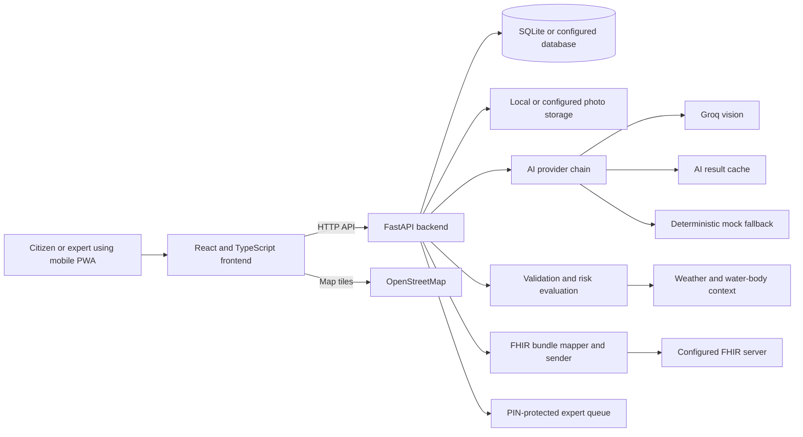

# AquaLens

AquaLens is a mobile-first progressive web app for AI-assisted, human-verified stream assessments. It supports citizen-science monitoring for OneAquaHealth, with explainable AI suggestions, rule-based validation, indicative One Health risk notes, and FHIR export.

**Primary track:** Track 3, AI-Supported Assessment  
**Secondary track:** Track 7, Digital Health Standards

## What the app does

Citizens choose a site, add stream photos, review AI suggestions, confirm or edit answers, and submit an assessment. AquaLens checks answers for inconsistencies, presents an advisory overall rating, calculates transparent risk notes, and saves the observation. Results can be viewed on a map, exported as FHIR, or sent to an expert queue for PIN-protected review.

AI suggestions do not replace the citizen's judgment: answers are confirmed or edited by the user before submission.

## Citizen workflow

1. **Choose a site:** Select a seeded site or add a site. Location can help identify nearby sites.
2. **Add photos:** Upload upstream, downstream, context, and biodiversity photos. Images are resized and EXIF metadata is stripped.
3. **Analyze:** Request AI suggestions for eligible fields. The provider chain supports Groq, cached results, and a mock fallback.
4. **Review answers:** Accept, edit, or mark suggestions as "not sure." Validation flags identify inconsistencies or answers that need review.
5. **Rate the observation:** Choose an overall assessment, then see the rule-based advisory comparison.
6. **Record feelings:** Complete the feelings questions.
7. **Review and save:** Check the assessment and submit it.
8. **View the result:** Read the risk notes and reasons, see validation flags, view or send the FHIR bundle, and navigate to the map.

## Other features

- **Risk notes:** Rule-based contact-safety and ecosystem-pressure levels with reasons. These are indicative only, not a safety certification.
- **FHIR:** View an observation's FHIR bundle and send it to the configured FHIR server. Photos, free text, and feelings are excluded from the public FHIR payload.
- **Map:** Browse observations on OpenStreetMap tiles, filter by risk or expert-review status, and open observation details.
- **Expert queue:** Review flagged observations, inspect photos and answers, then approve or correct them. Access uses a demo PIN sent in the `X-Expert-Pin` header.
- **Demo data:** Synthetic observations are identified as demo data in the UI.

## Architecture



The frontend is a Vite, React, TypeScript, and Tailwind PWA. The backend is a FastAPI service with SQLite by default, configurable photo storage, AI and context adapters, and a FHIR mapper.

## Screenshots

Add screenshots to `docs/screenshots/` and update these placeholder links.


## Setup

### Prerequisites

- Python 3.11 or later
- Node.js 20 or later
- npm

From the repository root, create the environment file if you want to customize settings:

```powershell
Copy-Item .env.example .env
```

The defaults support local development. Set `GROQ_API_KEY` and `GROQ_VISION_MODEL` in `.env` to enable Groq vision analysis. Without a working Groq configuration, the configured provider chain can fall back to cached or mock results.

### Backend (Windows PowerShell)

In a PowerShell terminal opened at the repository root:

```powershell
cd backend
python -m venv .venv
.\.venv\Scripts\Activate.ps1
pip install -r requirements.txt
uvicorn app.main:app --reload
```

The API is at `http://127.0.0.1:8000`. Interactive API documentation is at `http://127.0.0.1:8000/docs`.

Run the backend tests in a separate terminal:

```powershell
cd backend
.\.venv\Scripts\Activate.ps1
pytest
```

### Frontend (Windows PowerShell)

In another PowerShell terminal opened at the repository root:

```powershell
cd frontend
npm install
npm run dev
```

Open `http://127.0.0.1:5173`. The Vite development server proxies `/health`, `/api`, and `/uploads` to the backend on port 8000.

Run the frontend checks:

```powershell
cd frontend
npm run build
npm run lint
```

## Configuration

Settings are read from environment variables; see `.env.example` for the available options.

- `GROQ_API_KEY`, `GROQ_VISION_MODEL`: Groq vision provider credentials and model.
- `AI_PROVIDER_CHAIN`: Provider order; defaults to `groq,cache,mock`.
- `SLEEP_SECONDS`: Delay between AI calls.
- `DATABASE_URL`: Database connection; defaults to local SQLite.
- `EXPERT_PIN`: Demo expert-access PIN. Change it from the default before sharing a demo.
- `FHIR_SERVER_URL`: FHIR destination; defaults to the HAPI public test server.
- `FHIR_CODESYSTEM_URL`: CodeSystem URL used by FHIR export.
- `STORAGE_BACKEND`, `UPLOAD_DIR`: Photo storage configuration.
- `SUPABASE_URL`, `SUPABASE_KEY`, `SUPABASE_BUCKET`: Optional Supabase storage configuration.
- `CORS_ORIGINS`: Allowed frontend origins.

## Tests

Backend tests cover health, form schema, sites, storage, AI merge behavior, context and evaluation, validation, risk calculations, and FHIR mapping. Run them with `pytest` from `backend`.

Frontend checks are `npm run lint` and `npm run build` from `frontend`. `MANUAL_TEST_SCRIPT.md` describes the end-to-end citizen, result, map, and expert-review checks.

## Known limitations

- The expert PIN is demo-only authentication, not a substitute for production identity and access management.
- The feelings chart currently uses simulated demo data rather than a live aggregation endpoint.
- AI results depend on the configured provider. Cached and mock results are fallbacks, not replacements for live model analysis.
- Risk levels are transparent, rule-based indicators; they are not safety advice or certification.
- The default FHIR destination is a public test server. Configure and validate production FHIR endpoints and canonical terminology before real-world use.
- Some assessment details remain assumptions pending confirmation, including certain habitat and debris categories, the water-height unit, and the feelings scale.
- Demo observations are synthetic and should not be treated as environmental measurements.

## Roadmap

- Replace simulated feelings aggregates with a backend-backed site summary.
- Add production authentication and an expert-review audit trail.
- Confirm pending assessment definitions and update the form schema.
- Configure and validate production FHIR terminology and deployment.
- Consider map clustering and observation export as the dataset grows.
