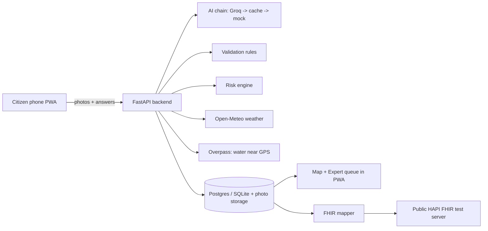
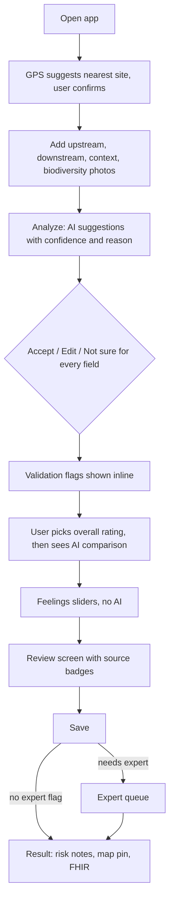

# AquaLens — PRD, TRD & Workflow (v2)
OneAquaHealth IEEE Global Hackathon 2026 · **Primary track: Track 3 (AI-Supported Assessment)** · Secondary: Track 7 (FHIR), light Track 2/6 insight
Deadline: 1 Oct 2026, 9:30am IST → submit the evening of 30 Sep.
This version replaces v1. Changes: Groq-only AI (with cache and mock fallbacks), the real 9-step form fields, overall-rating consistency check, per-field source badges, left/right handling, expert queue, and a demo-safe architecture. Field-level details live in `docs/02_form_schema_and_ai.md` (source of truth).

> Tagline: *From streams to systems — AI-assisted, human-verified, standards-based stream assessment.*

---
# PART 1 — PRD

## 1. Problem
The official Citizen Science App asks citizens to complete a 9-step assessment: pick a site from a code list, upload five media items, answer about 25 questions by matching reference pictures, give an overall rating and rate their feelings. Citizen observations are inconsistent and error-prone (the Track 3 brief): many answers end up "not sure" or wrong, nothing checks for contradictions, left and right banks get confused, and scientists cannot easily tell which records to trust.

## 2. Vision and principles
A citizen uploads photos; AI **suggests** answers with confidence and a reason; the citizen **confirms or edits every one**; validation rules catch contradictions; doubtful records go to an expert; everything is stored as FHIR data and turned into a plain-language, indicative One Health note.
1. AI suggests, human decides. 2. Show why (confidence + reason). 3. "Not sure" is a valid answer. 4. Transparent rules for risk, not black-box scores. 5. Works when AI is down. 6. Zero cost.

## 3. Users
| User | Need |
|---|---|
| Citizen volunteer | A fast, guided assessment they can trust, in plain language |
| Scientist / reviewer | A queue of only the doubtful records, with reasons |
| Community / authority | A simple risk map per site and standards-based data |

## 4. Goals and non-goals
**Goals:** raise data quality, keep human judgment in control, reduce effort per assessment, interoperable output, understandable One Health insight.
**Non-goals:** custom-trained models, real login, payments, video analysis, replacing the official app, official safety certification.

## 5. MVP features
| ID | Feature | Acceptance criteria |
|---|---|---|
| F1 | Site and GPS | Browser GPS suggests nearest sites (map + list); manual pick and "add site" fallback; handles denied location without showing "NaN" |
| F2 | Photos | Four slots: upstream, downstream, context, biodiversity. Client-side resize to about 1024 px (this strips EXIF); server also strips EXIF |
| F3 | AI suggestions | For every AI-eligible field: value, confidence 0–1, one-sentence reason. Upstream/downstream merge rules apply. Works with AI down (manual entry) |
| F4 | Review and confirm | Each field shows the AI suggestion with Accept / Edit / Not sure. Every stored field records its source: ai_accepted, ai_edited, human, unanswered |
| F5 | Validation flags | Rules in docs/02 section 4, shown inline in plain language. Some force expert review |
| F6 | Overall rating | User chooses Good/Moderate/Poor **first**; then an advisory comparison with reasons; a two-level difference flags the record |
| F7 | Feelings | Joy, Serenity, Anger, Fear sliders with Not applicable. No AI |
| F8 | Risk notes | Contact-safety note (people and pets) and ecosystem-pressure note, each Low/Moderate/High with reasons and "Indicative only, not a safety certification" |
| F9 | Map | Pins coloured by risk, filter by risk and "needs review", popup summary |
| F10 | Expert queue | PIN-protected (demo-only) queue; approve or correct; corrections stored; status shown on map |
| F11 | FHIR | View bundle; "Send to FHIR test server" with server response shown |
| F12 | Demo data | About 25 synthetic observations flagged as "Demo data" |

**Nice to have (only if all above is done):** upstream-vs-downstream note polish, wellbeing chart per site, offline queue, second language (Bengali/Hindi), CSV import/export.

## 6. Success measures (for the pitch)
- An assessment takes under 2 minutes in the demo.
- Share of AI suggestions accepted vs edited is visible.
- Number of contradictions caught by validation in the demo dataset.
- FHIR bundle validates and the test server accepts it.

## 7. Responsible-AI requirements
AI suggests, human confirms · confidence and reason always shown · alerts labelled indicative · never accuse anyone of discharge; describe only what is visible · no personal data to the AI or FHIR server (photos of water only, EXIF stripped, no photos/feelings/free text sent to public FHIR) · synthetic data labelled · limitations documented.

## 8. Judging map
| Criterion | Where satisfied |
|---|---|
| Impact and alignment | F8 risk notes, contact-safety wording for people and pets, ecosystem pressures, wellbeing view |
| Innovation | F3+F4+F5+F6: explainable suggestions, contradiction checks, overall-rating consistency, verify-and-learn expert loop |
| Architecture | Adapter-based AI chain, rule engine, FHIR mapper with live POST, open APIs |
| UX | Photo-first flow, plain language, "not sure" always allowed, GPS site suggestion, mobile PWA |
| Scale | FHIR interoperability, adapters for every external service, demo-to-production config via env vars |

## 9. Open questions
1. Is a team required? (see docs/00)
2. Does the official app have an API or export? Ask in Slack.
3. Habitats/Debris letters and Water height unit (see docs/02 section 8).
4. Groq vision model ID and free limits; result of the photo test.

---
# PART 2 — TRD

## 1. Architecture


## 2. Zero-cost stack
| Layer | Choice | Notes |
|---|---|---|
| Frontend | Vite + React + TypeScript + Tailwind + react-router + react-leaflet + vite-plugin-pwa | Host on Vercel or Cloudflare Pages (free) |
| Backend | FastAPI (Python 3.11), Pydantic v2, SQLAlchemy 2, Pillow, httpx | Render free web service or Hugging Face Space; free instances sleep, so warm before demos |
| Database and photos | SQLite locally, Supabase Postgres + Storage in production (DATABASE_URL) | Free projects can pause when inactive; keep active |
| AI | Groq vision model via `groq` SDK, JSON mode, temperature 0 | Free tier: mind tokens per minute; each image is about 2048 input tokens. Model ID from Groq docs |
| AI fallbacks | Cache of previous results (sha256 of resized image + role), then deterministic mock | Keeps the demo alive on rate limits or outages |
| Weather | Open-Meteo | Free, no key |
| Water-body check | OpenStreetMap Overpass | Free, cache, unknown never creates a flag |
| Map | Leaflet + OpenStreetMap tiles | Demo-scale use |
| FHIR | `fhir.resources` + public HAPI FHIR R4 test server | Never send personal data |
| Repo/CI | GitHub public repo | Free |
| Video | OBS Studio | Free |
Free-tier limits change: verify on Day 1 and design to the strictest.

## 3. Data model
```
sites(id, name, code, lat, lon, is_demo, created_at)
observations(id, site_id, user_lat, user_lon, facing_downstream, captured_at,
             photos_json, answers_json, ai_suggestions_json, field_sources_json,
             flags_json, needs_expert, status[draft|confirmed|flagged|approved|corrected],
             overall_user, overall_suggested, risk_contact, risk_ecosystem, risk_reasons_json,
             feelings_json, is_synthetic, fhir_sent_at)
reviews(id, observation_id, decision, corrections_json, reviewer_note, reviewed_at)
```

## 4. API
| Endpoint | Purpose |
|---|---|
| GET /api/form-schema | Fields, codes, help text; frontend renders from this |
| GET /api/sites?lat&lon · POST /api/sites | Nearest sites / add site |
| POST /api/analyze | Photos → AI suggestions, never saves |
| POST /api/observations/evaluate | Dry run: flags, risk notes, suggested overall rating |
| POST /api/observations | Save confirmed observation |
| GET /api/observations · GET /api/observations/{id} | Map list / detail |
| GET /api/queue · POST /api/observations/{id}/review | Expert queue and decision (PIN header) |
| GET /api/observations/{id}/fhir · POST .../fhir/send | Bundle / send to test server |
| GET /health | Health check (also used to warm the server) |

## 5. AI adapter design
- Interface `AIProvider.analyze(image, role) -> validated suggestions`.
- One call per photo by role (upstream, downstream, context, biodiversity) to stay under the free token limit; wait between calls; one retry on rate limit.
- Chain from `AI_PROVIDER_CHAIN` (default groq,cache,mock). Every success is written to the cache. If all fail, return `ai_unavailable` and the UI falls back to manual entry.
- Output validated with Pydantic: value in allowed set, confidence 0–1, non-empty reason; invalid → not_sure, confidence 0, reason "AI output invalid".
- Merge: upstream+downstream agree → keep value with lower confidence; disagree → not_sure "photos differ"; any "yes" for draining_pipes, sewage_discharge, construction wins and sets needs_expert.
- Left/right: margins returned as seen in the image; mapped to stream left/right only if the user confirmed they faced downstream.
- Prompt rules and JSON contract: docs/02 section 3.

## 6. Validation and risk
Rules and thresholds are in docs/02 sections 4 and 5. All are pure functions with table-driven tests. Weather (48 h rainfall, temperature) and the water-body check enrich the evaluation but never block it; failures degrade silently to "unknown".

## 7. FHIR mapping
- **Location** for the site (lat/lon).
- **Observation** per answered field: status, category survey, code from a custom CodeSystem (`FHIR_CODESYSTEM_URL`), valueCodeableConcept, subject = Location, effectiveDateTime, note = AI reason or reviewer note.
- Observations for overall rating and the two risk levels.
- **Provenance** per field: ai_accepted, ai_edited or human.
- Bundle type transaction. The bundle sent to the public server excludes photos, free text and feelings.
- Validate with the library and the server's `$validate`; report what could not be validated offline.

## 8. Security and privacy
Strip EXIF (client and server) · no names or emails collected · secrets only in `.env`, with `.env.example` committed · rate-limit `/api/analyze` · expert PIN in a header (demo-only, documented) · CORS limited to the frontend origin.

## 9. Configuration
See `.env.example`: GROQ_API_KEY, GROQ_VISION_MODEL, SLEEP_SECONDS, AI_PROVIDER_CHAIN, DATABASE_URL, EXPERT_PIN, FHIR_SERVER_URL, FHIR_CODESYSTEM_URL, CORS_ORIGINS.

## 10. Testing
Unit tests: form schema validation, merge rules, all validation rules, risk engine, FHIR mapper. Real AI is never called in tests (mock provider). Day-1 Groq photo test with 12 photos and your own labels. Smoke test against the deployed URL. Manual test on a real phone.

## 11. Deployment
Backend on Render or Hugging Face Spaces, frontend on Vercel or Cloudflare Pages, database on Supabase free tier. A warm-up script hits `/health` before demos and judging.

---
# PART 3 — WORKFLOW

## A. Citizen workflow


## B. Expert workflow
Open Expert tab → enter PIN → see flagged records with photos, answers, flags → approve or correct fields → save review → status changes and the map updates.

## C. Development workflow
Use `_my_notes/prompts.md` (Prompts 0–10) in Cursor, one at a time. Review, run tests, commit after each prompt. Keep `docs/05_implementation_plan.md` current.

## D. Timeline (today is 19 Sep)
| Date | Work |
|---|---|
| 19–20 Sep | Setup, Groq photo test, Prompt 0 plan, Prompt 1 scaffold |
| 21 Sep | Prompt 2: form schema, sites, observations, storage |
| 22 Sep | Prompt 3: AI chain and /api/analyze |
| 23 Sep | Prompt 4: validation, risk, weather, water check |
| 24 Sep | Prompt 5: FHIR |
| 25–26 Sep | Prompts 6–7: citizen flow |
| 27 Sep | Prompt 8: result, map, expert queue |
| 28 Sep | Prompt 9: seed data, deployment |
| 29 Sep | Prompt 10: polish, README, demo video |
| 30 Sep | Final test on the live link, submit |

## E. Demo video script (3–5 min)
1. 0:00–0:30 Problem: 9 steps, guesswork, no checks, scientists cannot trust the data.
2. 0:30–1:30 Take photos → AI suggests → user edits one answer.
3. 1:30–2:15 Validation flags a contradiction; the overall rating comparison appears; record goes to the expert queue and is corrected.
4. 2:15–3:00 Risk notes with reasons for people, pets and ecosystem; map.
5. 3:00–3:45 FHIR view and live POST to the test server.
6. 3:45–4:30 Scale, responsible-AI statement, limitations, roadmap.

## F. Devpost checklist
- [ ] Track stated: Track 3 primary (+ Track 7, light Track 2/6)
- [ ] Description: problem, solution, users, impact
- [ ] Demo video 3–5 min, public link
- [ ] Public GitHub repo with README, architecture diagram, setup and limitations
- [ ] Live prototype link (servers warmed)
- [ ] Data honesty and responsible-AI notes
- [ ] Submitted with hours to spare

## G. Risks and cut order
| Risk | Mitigation |
|---|---|
| Groq quality or limits | Day-1 test, cache and mock fallbacks |
| Free servers sleeping | Warm-up script, health check |
| FHIR validation errors | Build and validate one Observation first |
| Scope creep | Non-goals list and cut order |
| Unconfirmed form details | Presence-only fields until confirmed |
**Cut in this order if behind:** wellbeing chart → expert "Correct" (keep Approve) → upstream-vs-downstream note → biodiversity analysis.
**Never cut:** AI review with confirmation, validation flags, FHIR export, map, expert queue, deployed demo, video.
